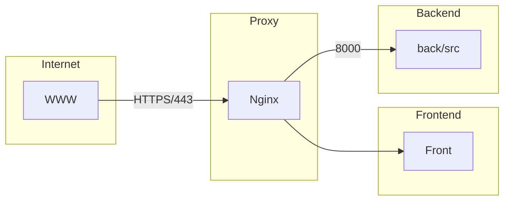

# Transcendence Project

## Overview
This project is a web application built with a containerized architecture using **Nginx, a backend service, and a frontend service**. The architecture follows this flow:



### **Architecture Components**
- **Internet**: External access to the application.
- **Proxy (Nginx)**: Acts as a reverse proxy, forwarding requests to the frontend and backend.
- **Frontend**: A TypeScript-based UI served by Nginx.
- **Backend**: A Node.js-based server handling application logic and database communication.

## **Feature Checklist**
### **Major Modules** (1 point each)
✅ Use a framework to build the backend. (Express.js)  
✅ Standard user management, authentication, users across tournaments.  
✅ Remote players (1 point) (?)  
✅ Implement Two-Factor Authentication (2FA) and JWT. (?)  

### **Minor Modules** (0.5 points each)
✅ Use a framework or a toolkit to build the frontend.  
✅ Use a database for the backend.  
✅ Game customization options.  
✅ User and game stats dashboards.  
✅ Monitoring system.  
✅ Supports multiple languages.  

## **Technologies Used**
- **Frontend**: TypeScript, Tailwind CSS
- **Backend**: Node.js, Express.js
- **Database**: (To be decided)
- **Proxy**: Nginx
- **Authentication**: JWT, Two-Factor Authentication (2FA)
- **Monitoring**: (To be decided)

## **Setup Instructions**
1. Clone the repository:
   ```sh
   git clone https://github.com/your-repo/transcendence.git
   cd transcendence
   ```
2. Start the application using Docker Compose:
   ```sh
   docker compose up --build
   ```
3. The application will be available at `https://localhost:443/`

---

This README provides an overview of the project architecture and feature list. More details will be added as the project evolves.

