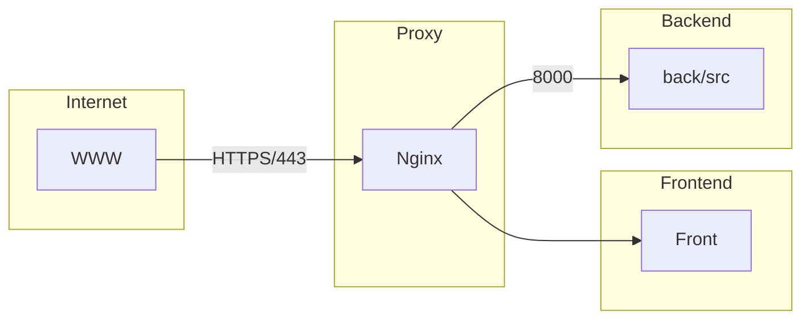

# Transcendence Project

## Overview
This project is a web application built with a containerized architecture using **Nginx, a backend service, and a frontend service**. The architecture follows this flow:



### **Architecture Components**
- **Internet**: External access to the application.
- **Proxy (Nginx)**: Acts as a reverse proxy, forwarding requests to the frontend and backend.
- **Frontend**: A TypeScript-based UI served by Nginx.
- **Backend**: A Node.js-based server handling application logic and database communication.

## **Feature Checklist**
✅ = done  
💻 = in progress  
❌ = free to develop  

🐶 = Paula  
🐱 = Alex  
🐭 = Israel  
🐹 = Pau  
🐰 = Anna  

### Web  
| Points | Status | Student | Module |
|--------|--------|----------|--------|
| 1      | ✅     | 🐱       | Major module: Use a framework to build the backend. |
| 0.5    | 💻     | 🐶       | Minor module: Use a framework or a toolkit to build the frontend. |
| 0.5    | ✅     | 🐱       | Minor module: Use a database for the backend. |
|        | ❌     |          | Major module: Store the score of a tournament in the Blockchain. |

### User Management  
| Points | Status | Student | Module |
|--------|--------|----------|--------|
| 1      | ✅     | 🐱        | Major module: Standard user management, authentication, users across tournaments. |
| 1      | 💻     | 🐱        | Major module: Implementing a remote authentication. |

### Gameplay and User Experience  
| Points | Status | Student |Module |
|--------|--------|----------|-------|
|        | ❌     |          |Major module: Remote players |
|        | ❌     |          |Major module: Multiplayer (more than 2 players in the same game). |
|        | ❌     |          |Major module: Add another game with user history and matchmaking. |
|        | ❌     |          |Minor module: Game customization options. |
|        | ❌     |🐰        |Major module: Live chat. |

### AI-Algo  
| Points | Status | Student | Module |
|--------|--------|----------|--------|
|        | ❌     |          | Major module: Introduce an AI opponent. |
|        | ❌     | 🐱       | Minor module: User and game stats dashboards. |

### Cybersecurity  
| Points | Status | Student |Module |
|--------|--------|----------|-------|
|        | ❌     |           | Major module: Implement WAF/ModSecurity with a hardened configuration and HashiCorp Vault for secrets management. |
|        | ❌     |           |Minor module: GDPR compliance options with user anonymization, local data management, and Account Deletion. |
| 1      | 💻     | 🐱        |Major module: Implement Two-Factor Authentication (2FA) and JWT. |

### DevOps  
| Points | Status | Student | Module |
|--------|--------|----------|--------|
|        | ❌     | 🐱       | Major module: Infrastructure setup for log management. |
|        | ❌     |          | Minor module: Monitoring system. |
|        | ❌     |          | Major module: Designing the backend as microservices. |

### Graphics  
| Points | Status | Student | Module |
|--------|--------|----------|--------|
|        | ❌     |           | Major module: Use advanced 3D techniques. |

### Accessibility  
| Points | Status | Student | Module |
|--------|--------|----------|--------|
|        | ❌     |           | Minor module: Support on all devices. |
|        | ❌     |           | Minor module: Expanding browser compatibility. |
|        | ❌     |  🐰       | Minor module: Supports multiple languages. |
|        | ❌     |           | Minor module: Add accessibility features for visually impaired users. |
|        | ❌     |           | Minor module: Server-Side Rendering (SSR) integration. |

### Server-Side Pong  
| Points | Status | Student | Module |
|--------|--------|----------|--------|
|        | ❌     |          | Major module: Replace basic Pong with server-side Pong and implement an API. |
|        | ❌     | 🐱       | Major module: Enabling Pong gameplay via CLI against web users with API integration. |

### **Total**  
**5.0**  


## **Technologies Used**
- **Frontend**: TypeScript, Tailwind CSS
- **Backend**: Node.js
- **Database**: SQLite
- **Proxy**: Nginx
- **Authentication**: JWT, Two-Factor Authentication (2FA)
- **Monitoring**: Prometheus, Grafana

## **Setup Instructions**
1. Clone the repository:
   ```sh
   git clone https://github.com/your-repo/transcendence.git
   cd transcendence
   ```
2. Start the application using Docker Compose:
   ```sh
   docker compose up --build
   ```
3. The application will be available at `https://localhost:443/`

---

This README provides an overview of the project architecture and feature list. More details will be added as the project evolves.

